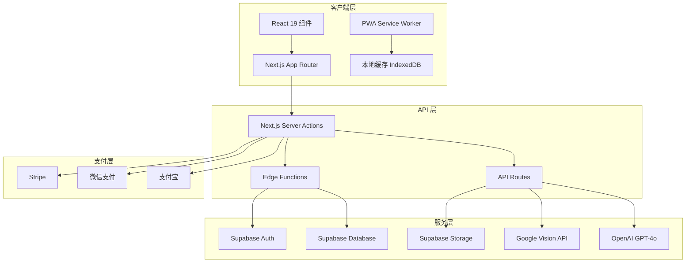

# 设计文档 - 吃了么 APP

## 概述

吃了么是一个基于 Next.js 15 和 React 19 构建的 PWA 应用，采用现代化的技术栈实现极简三餐饮食记录、AI 拍照识别热量、健康激励返现和轻社交功能。应用采用 App Router 架构，使用 Supabase 作为后端服务，集成 Google Vision API 和 GPT-4o 提供 AI 能力。

### 核心设计目标

1. **极简用户体验**: 移动端优先，原生 APP 质感，流畅动效
2. **高性能**: 页面加载 < 2 秒，交互响应 < 500ms
3. **离线可用**: PWA 特性，支持离线记录和同步
4. **可扩展性**: 模块化架构，易于添加新功能
5. **安全性**: 防作弊机制，支付安全，数据加密

## 架构

### 整体架构



### 技术栈详细说明

#### 前端核心
- **Next.js 15**: App Router，Server Components，Server Actions
- **React 19**: 最新特性，优化渲染性能
- **TypeScript**: 类型安全，提升开发体验
- **Tailwind CSS v4**: 原子化 CSS，快速样式开发

#### UI 与交互
- **shadcn/ui**: 高质量可定制组件库
- **Radix UI**: 无障碍访问的底层组件
- **framer-motion**: 流畅动画和页面过渡
- **react-use-gesture**: 手势和触摸交互

#### 状态管理与数据
- **TanStack Query v5**: 服务端状态管理，缓存优化
- **Zod**: 运行时类型验证
- **React Hook Form**: 表单状态管理
- **Recharts**: 数据可视化图表

#### PWA 能力
- **next-pwa 5.8**: PWA 配置和优化
- **Workbox**: Service Worker 管理
- **Web Push API**: 推送通知

#### 后端与数据库
- **Supabase**: PostgreSQL 数据库，认证，存储
- **Supabase Realtime**: 实时数据同步
- **Row Level Security**: 数据库级别的权限控制

#### AI 服务
- **Google Vision API**: 食物图像识别
- **OpenAI GPT-4o**: AI 健康分析和建议

#### 支付集成
- **Stripe**: 国际支付
- **微信支付 SDK**: 国内微信支付
- **支付宝 SDK**: 国内支付宝支付

## 组件与接口

### 页面组件结构

```
app/
├── (auth)/
│   ├── login/
│   │   └── page.tsx              # 登录页
│   └── onboarding/
│       └── page.tsx              # 新用户引导页
├── (main)/
│   ├── layout.tsx                # 主布局（底部导航）
│   ├── page.tsx                  # 首页 - 今日饮食记录
│   ├── add-meal/
│   │   └── page.tsx              # 添加饮食页
│   ├── camera/
│   │   └── page.tsx              # AI 拍照识别页
│   ├── stats/
│   │   └── page.tsx              # 数据统计页
│   ├── social/
│   │   └── page.tsx              # 饮食朋友圈
│   ├── challenge/
│   │   ├── page.tsx              # 挑战首页
│   │   ├── join/
│   │   │   └── page.tsx          # 参与挑战页
│   │   └── leaderboard/
│   │       └── page.tsx          # 排行榜页
│   └── profile/
│       ├── page.tsx              # 个人中心
│       ├── edit/
│       │   └── page.tsx          # 编辑资料
│       ├── rewards/
│       │   └── page.tsx          # 我的奖励
│       ├── membership/
│       │   └── page.tsx          # 会员中心
│       └── settings/
│           └── page.tsx          # 设置
└── api/
    ├── auth/
    │   └── route.ts              # 认证 API
    ├── ai/
    │   ├── vision/
    │   │   └── route.ts          # 图像识别 API
    │   └── analysis/
    │       └── route.ts          # AI 分析 API
    ├── payment/
    │   ├── stripe/
    │   │   └── route.ts          # Stripe 支付
    │   ├── wechat/
    │   │   └── route.ts          # 微信支付
    │   └── alipay/
    │       └── route.ts          # 支付宝支付
    └── webhooks/
        └── route.ts              # 支付回调
```

### 核心组件接口

#### 1. 认证组件

```typescript
// components/auth/LoginForm.tsx
interface LoginFormProps {
  onSuccess: (user: User) => void;
  onError: (error: Error) => void;
}

interface User {
  id: string;
  phone: string;
  wechatId?: string;
  profile: UserProfile;
  createdAt: Date;
}

interface UserProfile {
  nickname: string;
  avatar: string;
  height: number;        // cm
  weight: number;        // kg
  targetWeight: number;  // kg
  age: number;
  gender: 'male' | 'female' | 'other';
  activityLevel: 'sedentary' | 'light' | 'moderate' | 'active' | 'very_active';
  dailyCalorieTarget: number;
}
```

#### 2. 饮食记录组件

```typescript
// components/meal/MealRecordCard.tsx
interface MealRecordCardProps {
  record: MealRecord;
  onEdit: (record: MealRecord) => void;
  onDelete: (id: string) => void;
}

interface MealRecord {
  id: string;
  userId: string;
  mealType: 'breakfast' | 'lunch' | 'dinner' | 'snack';
  foods: FoodItem[];
  totalCalories: number;
  totalProtein: number;
  totalFat: number;
  totalCarbs: number;
  imageUrl?: string;
  createdAt: Date;
  updatedAt: Date;
}

interface FoodItem {
  id: string;
  name: string;
  calories: number;
  protein: number;
  fat: number;
  carbs: number;
  serving: number;
  unit: string;
}
```

#### 3. AI 识别组件

```typescript
// components/ai/CameraCapture.tsx
interface CameraCaptureProps {
  onCapture: (image: File) => void;
  onCancel: () => void;
}

// services/ai/visionService.ts
interface VisionService {
  recognizeFood(image: File): Promise<FoodRecognitionResult>;
}

interface FoodRecognitionResult {
  success: boolean;
  foods: RecognizedFood[];
  confidence: number;
  processingTime: number;
}

interface RecognizedFood {
  name: string;
  calories: number;
  protein: number;
  fat: number;
  carbs: number;
  confidence: number;
}
```

#### 4. 挑战组件

```typescript
// components/challenge/ChallengeCard.tsx
interface ChallengeCardProps {
  challenge: Challenge;
  onJoin?: () => void;
  onViewDetails?: (id: string) => void;
}

interface Challenge {
  id: string;
  userId: string;
  startDate: Date;
  endDate: Date;
  deposit: number;
  dailyTasks: DailyTask[];
  totalReward: number;
  rewardPool: number;
  status: 'pending' | 'active' | 'completed' | 'failed';
  createdAt: Date;
}

interface DailyTask {
  day: number;
  date: Date;
  completed: boolean;
  reward: number;
  tasks: {
    mealRecorded: boolean;
    calorieTarget: boolean;
    exerciseTarget?: boolean;
  };
}
```

#### 5. 社交组件

```typescript
// components/social/FeedCard.tsx
interface FeedCardProps {
  post: SocialPost;
  onLike: (postId: string) => void;
  onComment: (postId: string, comment: string) => void;
  onReport: (postId: string) => void;
}

interface SocialPost {
  id: string;
  userId: string;
  user: {
    nickname: string;
    avatar: string;
  };
  content: string;
  images: string[];
  mealRecordId?: string;
  likes: number;
  comments: Comment[];
  isLiked: boolean;
  status: 'published' | 'reviewing' | 'rejected';
  createdAt: Date;
}

interface Comment {
  id: string;
  userId: string;
  user: {
    nickname: string;
    avatar: string;
  };
  content: string;
  createdAt: Date;
}
```

### Server Actions

```typescript
// app/actions/meal.ts
export async function createMealRecord(data: CreateMealRecordInput): Promise<MealRecord>;
export async function updateMealRecord(id: string, data: UpdateMealRecordInput): Promise<MealRecord>;
export async function deleteMealRecord(id: string): Promise<void>;
export async function getMealRecordsByDate(userId: string, date: Date): Promise<MealRecord[]>;

// app/actions/challenge.ts
export async function joinChallenge(userId: string, deposit: number): Promise<Challenge>;
export async function checkDailyTask(challengeId: string, day: number): Promise<DailyTask>;
export async function calculateRewardPool(challengeId: string): Promise<number>;
export async function distributeRewards(challengeId: string): Promise<void>;

// app/actions/ai.ts
export async function analyzeNutrition(userId: string, date: Date): Promise<NutritionAnalysis>;
export async function generateHealthAdvice(userId: string): Promise<HealthAdvice>;

// app/actions/social.ts
export async function createPost(data: CreatePostInput): Promise<SocialPost>;
export async function likePost(postId: string, userId: string): Promise<void>;
export async function commentPost(postId: string, userId: string, content: string): Promise<Comment>;
export async function reportPost(postId: string, userId: string, reason: string): Promise<void>;
```

## 数据模型

### 数据库 Schema (PostgreSQL)

```sql
-- 用户表
CREATE TABLE users (
  id UUID PRIMARY KEY DEFAULT uuid_generate_v4(),
  phone VARCHAR(20) UNIQUE,
  wechat_id VARCHAR(100) UNIQUE,
  nickname VARCHAR(50) NOT NULL,
  avatar TEXT,
  height DECIMAL(5,2),
  weight DECIMAL(5,2),
  target_weight DECIMAL(5,2),
  age INTEGER,
  gender VARCHAR(10),
  activity_level VARCHAR(20),
  daily_calorie_target INTEGER,
  membership_tier VARCHAR(20) DEFAULT 'free',
  membership_expires_at TIMESTAMP,
  created_at TIMESTAMP DEFAULT NOW(),
  updated_at TIMESTAMP DEFAULT NOW()
);

-- 饮食记录表
CREATE TABLE meal_records (
  id UUID PRIMARY KEY DEFAULT uuid_generate_v4(),
  user_id UUID REFERENCES users(id) ON DELETE CASCADE,
  meal_type VARCHAR(20) NOT NULL,
  total_calories DECIMAL(8,2) NOT NULL,
  total_protein DECIMAL(8,2),
  total_fat DECIMAL(8,2),
  total_carbs DECIMAL(8,2),
  image_url TEXT,
  recorded_at TIMESTAMP NOT NULL,
  created_at TIMESTAMP DEFAULT NOW(),
  updated_at TIMESTAMP DEFAULT NOW()
);

-- 食物条目表
CREATE TABLE food_items (
  id UUID PRIMARY KEY DEFAULT uuid_generate_v4(),
  meal_record_id UUID REFERENCES meal_records(id) ON DELETE CASCADE,
  name VARCHAR(100) NOT NULL,
  calories DECIMAL(8,2) NOT NULL,
  protein DECIMAL(8,2),
  fat DECIMAL(8,2),
  carbs DECIMAL(8,2),
  serving DECIMAL(8,2),
  unit VARCHAR(20),
  created_at TIMESTAMP DEFAULT NOW()
);

-- 挑战表
CREATE TABLE challenges (
  id UUID PRIMARY KEY DEFAULT uuid_generate_v4(),
  user_id UUID REFERENCES users(id) ON DELETE CASCADE,
  start_date DATE NOT NULL,
  end_date DATE NOT NULL,
  deposit DECIMAL(10,2) NOT NULL,
  total_reward DECIMAL(10,2) DEFAULT 0,
  reward_pool DECIMAL(10,2) DEFAULT 0,
  status VARCHAR(20) DEFAULT 'pending',
  created_at TIMESTAMP DEFAULT NOW(),
  updated_at TIMESTAMP DEFAULT NOW(),
  CONSTRAINT one_active_challenge_per_user UNIQUE (user_id, status)
);

-- 每日任务表
CREATE TABLE daily_tasks (
  id UUID PRIMARY KEY DEFAULT uuid_generate_v4(),
  challenge_id UUID REFERENCES challenges(id) ON DELETE CASCADE,
  day INTEGER NOT NULL,
  task_date DATE NOT NULL,
  completed BOOLEAN DEFAULT FALSE,
  reward DECIMAL(10,2) NOT NULL,
  meal_recorded BOOLEAN DEFAULT FALSE,
  calorie_target_met BOOLEAN DEFAULT FALSE,
  exercise_target_met BOOLEAN,
  checked_at TIMESTAMP,
  created_at TIMESTAMP DEFAULT NOW(),
  CONSTRAINT unique_day_per_challenge UNIQUE (challenge_id, day)
);

-- 社交动态表
CREATE TABLE social_posts (
  id UUID PRIMARY KEY DEFAULT uuid_generate_v4(),
  user_id UUID REFERENCES users(id) ON DELETE CASCADE,
  content TEXT,
  images TEXT[],
  meal_record_id UUID REFERENCES meal_records(id) ON DELETE SET NULL,
  likes_count INTEGER DEFAULT 0,
  comments_count INTEGER DEFAULT 0,
  status VARCHAR(20) DEFAULT 'published',
  created_at TIMESTAMP DEFAULT NOW(),
  updated_at TIMESTAMP DEFAULT NOW()
);

-- 点赞表
CREATE TABLE post_likes (
  id UUID PRIMARY KEY DEFAULT uuid_generate_v4(),
  post_id UUID REFERENCES social_posts(id) ON DELETE CASCADE,
  user_id UUID REFERENCES users(id) ON DELETE CASCADE,
  created_at TIMESTAMP DEFAULT NOW(),
  CONSTRAINT unique_like UNIQUE (post_id, user_id)
);

-- 评论表
CREATE TABLE post_comments (
  id UUID PRIMARY KEY DEFAULT uuid_generate_v4(),
  post_id UUID REFERENCES social_posts(id) ON DELETE CASCADE,
  user_id UUID REFERENCES users(id) ON DELETE CASCADE,
  content TEXT NOT NULL,
  created_at TIMESTAMP DEFAULT NOW()
);

-- 关注表
CREATE TABLE user_follows (
  id UUID PRIMARY KEY DEFAULT uuid_generate_v4(),
  follower_id UUID REFERENCES users(id) ON DELETE CASCADE,
  following_id UUID REFERENCES users(id) ON DELETE CASCADE,
  created_at TIMESTAMP DEFAULT NOW(),
  CONSTRAINT unique_follow UNIQUE (follower_id, following_id),
  CONSTRAINT no_self_follow CHECK (follower_id != following_id)
);

-- 体重记录表
CREATE TABLE weight_records (
  id UUID PRIMARY KEY DEFAULT uuid_generate_v4(),
  user_id UUID REFERENCES users(id) ON DELETE CASCADE,
  weight DECIMAL(5,2) NOT NULL,
  recorded_at DATE NOT NULL,
  created_at TIMESTAMP DEFAULT NOW(),
  CONSTRAINT unique_weight_per_day UNIQUE (user_id, recorded_at)
);

-- 奖励记录表
CREATE TABLE reward_transactions (
  id UUID PRIMARY KEY DEFAULT uuid_generate_v4(),
  user_id UUID REFERENCES users(id) ON DELETE CASCADE,
  challenge_id UUID REFERENCES challenges(id) ON DELETE SET NULL,
  type VARCHAR(20) NOT NULL, -- 'daily_reward', 'pool_bonus', 'withdrawal'
  amount DECIMAL(10,2) NOT NULL,
  balance_after DECIMAL(10,2) NOT NULL,
  status VARCHAR(20) DEFAULT 'pending',
  payment_method VARCHAR(20),
  payment_account VARCHAR(100),
  processed_at TIMESTAMP,
  created_at TIMESTAMP DEFAULT NOW()
);

-- 支付记录表
CREATE TABLE payment_transactions (
  id UUID PRIMARY KEY DEFAULT uuid_generate_v4(),
  user_id UUID REFERENCES users(id) ON DELETE CASCADE,
  challenge_id UUID REFERENCES challenges(id) ON DELETE SET NULL,
  type VARCHAR(20) NOT NULL, -- 'deposit', 'membership'
  amount DECIMAL(10,2) NOT NULL,
  payment_method VARCHAR(20) NOT NULL,
  payment_provider VARCHAR(20) NOT NULL,
  transaction_id VARCHAR(100) UNIQUE,
  status VARCHAR(20) DEFAULT 'pending',
  created_at TIMESTAMP DEFAULT NOW(),
  updated_at TIMESTAMP DEFAULT NOW()
);

-- 防作弊记录表
CREATE TABLE anti_cheat_logs (
  id UUID PRIMARY KEY DEFAULT uuid_generate_v4(),
  user_id UUID REFERENCES users(id) ON DELETE CASCADE,
  device_id VARCHAR(100),
  ip_address INET,
  action_type VARCHAR(50),
  suspicious_reason TEXT,
  severity VARCHAR(20), -- 'low', 'medium', 'high'
  status VARCHAR(20) DEFAULT 'pending', -- 'pending', 'reviewed', 'confirmed', 'dismissed'
  created_at TIMESTAMP DEFAULT NOW()
);

-- 内容审核记录表
CREATE TABLE content_moderation_logs (
  id UUID PRIMARY KEY DEFAULT uuid_generate_v4(),
  post_id UUID REFERENCES social_posts(id) ON DELETE CASCADE,
  reporter_id UUID REFERENCES users(id) ON DELETE SET NULL,
  reason TEXT,
  ai_result JSONB,
  moderator_id UUID REFERENCES users(id) ON DELETE SET NULL,
  decision VARCHAR(20), -- 'approved', 'rejected', 'pending'
  created_at TIMESTAMP DEFAULT NOW(),
  reviewed_at TIMESTAMP
);

-- 索引
CREATE INDEX idx_meal_records_user_date ON meal_records(user_id, recorded_at);
CREATE INDEX idx_challenges_user_status ON challenges(user_id, status);
CREATE INDEX idx_daily_tasks_challenge ON daily_tasks(challenge_id, day);
CREATE INDEX idx_social_posts_user ON social_posts(user_id, created_at);
CREATE INDEX idx_post_likes_post ON post_likes(post_id);
CREATE INDEX idx_post_comments_post ON post_comments(post_id);
CREATE INDEX idx_user_follows_follower ON user_follows(follower_id);
CREATE INDEX idx_user_follows_following ON user_follows(following_id);
CREATE INDEX idx_weight_records_user_date ON weight_records(user_id, recorded_at);
CREATE INDEX idx_reward_transactions_user ON reward_transactions(user_id, created_at);
```

### Row Level Security (RLS) 策略

```sql
-- 用户只能查看和修改自己的数据
ALTER TABLE users ENABLE ROW LEVEL SECURITY;
CREATE POLICY users_policy ON users
  FOR ALL USING (auth.uid() = id);

-- 饮食记录策略
ALTER TABLE meal_records ENABLE ROW LEVEL SECURITY;
CREATE POLICY meal_records_policy ON meal_records
  FOR ALL USING (auth.uid() = user_id);

-- 挑战策略
ALTER TABLE challenges ENABLE ROW LEVEL SECURITY;
CREATE POLICY challenges_policy ON challenges
  FOR ALL USING (auth.uid() = user_id);

-- 社交动态策略（可查看关注用户的动态）
ALTER TABLE social_posts ENABLE ROW LEVEL SECURITY;
CREATE POLICY social_posts_read_policy ON social_posts
  FOR SELECT USING (
    status = 'published' AND (
      user_id = auth.uid() OR
      user_id IN (SELECT following_id FROM user_follows WHERE follower_id = auth.uid())
    )
  );
CREATE POLICY social_posts_write_policy ON social_posts
  FOR INSERT WITH CHECK (auth.uid() = user_id);
CREATE POLICY social_posts_update_policy ON social_posts
  FOR UPDATE USING (auth.uid() = user_id);
CREATE POLICY social_posts_delete_policy ON social_posts
  FOR DELETE USING (auth.uid() = user_id);
```

## 正确性属性

正确性属性是系统行为的形式化规范，描述了在所有有效执行中应该保持为真的特征。这些属性作为人类可读规范和机器可验证正确性保证之间的桥梁。

### 属性反思

在分析所有验收标准后，我识别出以下可以合并或优化的属性：

1. **输入验证属性合并**: 需求 2.4、2.5、2.6 关于身高、体重、年龄的验证可以合并为一个综合的用户信息验证属性
2. **热量计算属性**: 需求 2.2 和 2.3 都涉及热量计算，可以合并为一个属性验证计算的正确性和一致性
3. **任务完成判定**: 需求 10.4、10.6、10.7 都涉及任务完成的判定和后续操作，可以合并为一个综合属性
4. **奖金池分配**: 需求 11.1-11.7 涉及奖金池的完整生命周期，可以合并为几个核心属性
5. **社交互动**: 需求 15.2-15.4 的点赞、评论、通知可以合并为互动一致性属性

### 核心正确性属性

#### 属性 1: 用户认证验证码发送
*对于任意*有效的手机号，当用户请求登录时，系统应该成功发送验证码并记录发送时间。
**验证需求: 1.1**

#### 属性 2: 验证码认证正确性
*对于任意*用户和正确的验证码，系统应该成功创建或登录用户账户。
**验证需求: 1.2**

#### 属性 3: 验证码锁定机制
*对于任意*手机号，当连续输入错误验证码 3 次后，系统应该锁定该手机号 15 分钟，期间拒绝所有登录尝试。
**验证需求: 1.4**

#### 属性 4: 用户信息验证范围
*对于任意*用户输入，系统应该验证身高在 100-250cm、体重在 30-300kg、年龄在 10-120 岁范围内，超出范围的输入应该被拒绝。
**验证需求: 2.4, 2.5, 2.6**

#### 属性 5: 热量目标计算一致性
*对于任意*有效的用户基础信息（身高、体重、年龄、性别、活动量），系统计算的每日推荐热量应该符合 Harris-Benedict 公式，且当信息更新时应该重新计算并保持一致。
**验证需求: 2.2, 2.3**

#### 属性 6: 饮食记录持久化
*对于任意*有效的饮食记录，当用户确认添加后，系统应该成功保存到数据库，并且后续查询应该能够检索到该记录。
**验证需求: 3.3**

#### 属性 7: 热量统计实时更新
*对于任意*用户，当添加或删除饮食记录时，当日热量统计应该立即更新，反映最新的总热量和营养摄入。
**验证需求: 3.4, 5.5**

#### 属性 8: 食物热量计算准确性
*对于任意*食物和份量，系统计算的热量和营养信息应该基于食物数据库中的单位值按比例计算，计算结果应该准确无误。
**验证需求: 3.2**

#### 属性 9: AI 识别超时降级
*对于任意*上传的食物照片，如果 AI 识别超过 10 秒未返回结果，系统应该自动转为手动录入模式并提供常见食物候选列表。
**验证需求: 4.5, 4.7**

#### 属性 10: 历史记录查询完整性
*对于任意*日期和用户，系统应该返回该用户在该日期的所有饮食记录，且记录的总热量应该等于各条记录热量之和。
**验证需求: 6.1, 6.2, 6.3**

#### 属性 11: 记录删除一致性
*对于任意*饮食记录，当用户删除该记录后，系统应该重新计算该天的热量统计，且该记录不应该再出现在查询结果中。
**验证需求: 6.5**

#### 属性 12: 挑战唯一性约束
*对于任意*用户，在任意时刻，该用户最多只能有一个状态为 'active' 或 'pending' 的挑战，尝试创建第二个挑战应该被拒绝。
**验证需求: 9.5**

#### 属性 13: 挑战退款规则
*对于任意*挑战，如果挑战状态为 'pending'（未开始），用户应该能够撤销并获得全额退款；如果状态为 'active'（已开始），系统应该拒绝退款请求。
**验证需求: 9.6, 9.7**

#### 属性 14: 每日任务截止时间
*对于任意*挑战的每日任务，当当前时间超过 23:30 后，系统应该拒绝该日的任何补录请求。
**验证需求: 10.2**

#### 属性 15: 任务完成判定与返现
*对于任意*挑战的每日任务，当用户完成三餐记录且热量误差在目标的 ±10% 范围内时，系统应该标记任务为已完成并将对应天数的返现金额添加到用户账户；否则应该将返现金额转入奖金池。
**验证需求: 10.4, 10.6, 10.7, 10.8**

#### 属性 16: 返现金额计算准确性
*对于任意*完成的每日任务，系统计算的返现金额应该严格按照规则：D1=6元, D2=8元, D3=10元, D4=12元, D5=15元, D6=20元, D7=29元。
**验证需求: 10.5**

#### 属性 17: 奖金池分配公平性
*对于任意*结束的挑战，系统应该计算奖金池总额，扣除 15% 平台抽成后，将剩余 85% 平均分配给所有完成 7 天任务的全勤用户，且单人奖励不超过押金的 2 倍。
**验证需求: 11.1, 11.2, 11.3, 11.5**

#### 属性 18: 奖金池滚动机制
*对于任意*结束的挑战，如果没有全勤用户，系统应该将奖金池的 85%（扣除平台抽成后）滚入下一期奖金池，而不是分配给任何用户。
**验证需求: 11.6**

#### 属性 19: 提现门槛验证
*对于任意*提现请求，当用户余额大于或等于 10 元时系统应该允许提现，当余额小于 10 元时应该拒绝并提示最低提现金额。
**验证需求: 13.3, 13.4**

#### 属性 20: 社交动态照片限制
*对于任意*动态发布请求，如果照片数量超过 9 张或文字长度超过 500 字，系统应该拒绝发布并提示用户。
**验证需求: 14.4, 14.5**

#### 属性 21: 社交 Feed 过滤
*对于任意*用户查看社交 Feed，系统应该只显示该用户关注的用户发布的状态为 'published' 的动态，按时间倒序排列。
**验证需求: 15.1, 15.6**

#### 属性 22: 社交互动一致性
*对于任意*动态，当用户点赞或评论后，动态的点赞数或评论数应该相应增加，且动态作者应该收到通知。
**验证需求: 15.2, 15.3, 15.4**

#### 属性 23: 防作弊设备限制
*对于任意*挑战周期，同一设备 ID、手机号或支付账户应该最多只能参与一个挑战，重复参与应该被拒绝。
**验证需求: 21.1, 21.2, 21.3**

#### 属性 24: 重复图片检测
*对于任意*饮食记录，如果上传的照片与该用户历史记录中的照片重复（基于图片哈希），系统应该标记该记录为可疑并可能判定为无效。
**验证需求: 21.4**

#### 属性 25: 会员功能访问控制
*对于任意*免费用户，当使用 AI 拍照功能时，系统应该限制每日使用次数为 3 次，超过限制应该提示升级会员；对于会员用户，应该允许无限次使用。
**验证需求: 22.3, 22.4**

#### 属性 26: 内容审核流程
*对于任意*发布的动态，系统应该先通过 AI 进行内容初审，如果检测到违规内容应该拒绝发布；如果用户举报，应该加入人工审核队列。
**验证需求: 23.2, 23.3, 23.4**

#### 属性 27: 违规处罚累计
*对于任意*用户，当累计违规次数达到 3 次时，系统应该封禁该用户账号，禁止其继续使用应用。
**验证需求: 23.6**

#### 属性 28: 系统故障补偿
*对于任意*挑战参与者，如果系统故障导致用户无法提交记录且故障持续超过 2 小时，系统应该自动判定该日任务有效或提供全额退款。
**验证需求: 24.1, 24.2, 24.4**


## 错误处理

### 错误分类

| 错误类型 | 处理策略 | 用户反馈 |
|---------|---------|---------|
| 网络错误 | 重试 + 离线缓存 | Toast 提示，自动重试 |
| AI 识别超时 | 降级为手动模式 | 提示转为手动录入 |
| 支付失败 | 记录日志，允许重试 | 显示错误原因，重试按钮 |
| 验证码错误 | 计数器 + 锁定 | 提示剩余次数或锁定时间 |
| 数据验证失败 | 拒绝操作 | 表单字段级错误提示 |
| 图片上传失败 | 重试 + 压缩降级 | 提示重试或选择其他图片 |
| 数据库写入失败 | 事务回滚 + 重试 | 提示操作失败，请重试 |
| 权限不足 | 拒绝操作 | 提示需要登录或升级会员 |

### 全局错误边界

```typescript
// components/ErrorBoundary.tsx
interface ErrorBoundaryProps {
  fallback: React.ReactNode;
  onError?: (error: Error, errorInfo: React.ErrorInfo) => void;
  children: React.ReactNode;
}
```

- 每个页面级组件包裹 ErrorBoundary，防止单页崩溃影响全局
- Server Actions 统一返回 `{ success: boolean; data?: T; error?: string }` 格式
- TanStack Query 配置全局 `onError` 回调，统一处理 API 错误
- Zod schema 验证失败时返回结构化错误信息，前端逐字段展示

### 离线错误处理

- 离线时写入 IndexedDB 队列，联网后自动同步
- 同步冲突使用 `updated_at` 时间戳策略，最新数据优先
- 同步失败的记录保留在队列中，下次联网继续尝试

## 测试策略

### 测试框架选型

| 类型 | 工具 | 用途 |
|-----|------|------|
| 单元测试 | Vitest | 函数逻辑、工具函数、数据验证 |
| 属性测试 | fast-check + Vitest | 正确性属性验证 |
| 组件测试 | React Testing Library | UI 组件行为 |
| E2E 测试 | Playwright | 关键用户流程 |

### 属性测试 (Property-Based Testing)

使用 `fast-check` 库配合 Vitest 实现属性测试。每个正确性属性对应一个独立的属性测试用例。

配置要求：
- 每个属性测试最少运行 100 次迭代
- 每个测试用例必须注释引用设计文档中的属性编号
- 标签格式: `Feature: chi-le-me, Property {number}: {property_text}`

### 单元测试

单元测试聚焦于：
- 具体示例和边界条件（如验证范围边界值）
- 组件间集成点
- 错误条件和异常路径
- 特定业务规则的具体场景

避免编写过多单元测试 — 属性测试已覆盖大量输入组合。

### 测试覆盖重点

1. **热量计算逻辑**: Harris-Benedict 公式实现、食物热量按份量计算
2. **挑战业务规则**: 返现金额计算、奖金池分配、任务完成判定
3. **输入验证**: 用户信息范围验证、动态内容限制
4. **防作弊逻辑**: 设备/手机号/支付账户唯一性、重复图片检测
5. **支付流程**: 押金锁定、提现门槛、退款规则
6. **社交功能**: Feed 过滤、互动计数一致性、内容审核流程
